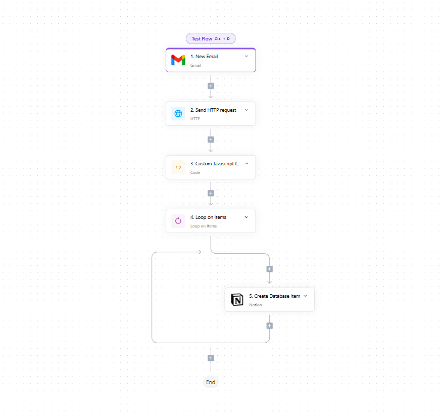

# 📧 Email to Task Automation (Activepieces Flow)

This repository contains a no-code/low-code automation built with [Activepieces](https://www.activepieces.com/) that turns incoming **Gmail emails into structured Notion tasks** using **Cohere AI** for natural language understanding.

---

## 💡 What It Does

Whenever a new email arrives in your Gmail inbox:

1. ✅ Activepieces triggers the flow
2. 🧠 The email content is sent to **Cohere AI** to extract a task description, due date, and priority
3. 🗃 The task is saved as a new row in a **Notion database**

---

### ✅ Example

**Email:**
> Subject: Client Follow-up  
> Body: "Don't forget to schedule a call with the client next Monday."

**Becomes this Notion task:**
```json
{
  "task": "Schedule a call with the client",
  "dueDate": "2025-05-26",
  "priority": "High"
}

## Setup Instructions

This project contains a template automation flow in JSON format, with all personal and private values removed. You must set up your own connections when importing it.

1. Clone This Repository
    git clone
    cd email-to-task-activepieces

2. Import Flow into Activepieces
Go to Activepieces Cloud

Click "My Flows" > "Import Flow"

Upload email-to-task-template.json from this repo

3. Connect Your Apps
You must reconnect the services with your own accounts:

## 🟢 Gmail
    Connect Gmail as a trigger for "New Email"

    Make sure to choose the correct label or inbox for filtering

## 🟣 Cohere AI
    Get your Cohere API key

    Replace YOUR_COHERE_API_KEY in the HTTP step: "Authorization": "Bearer YOUR_COHERE_API_KEY"

## ⚫ Notion
    Connect your Notion account

    Grant access to the correct Notion database

## 🧱 Notion Database Setup
    To work correctly, your Notion database must contain:

    | Property Name | Type   | Notes                                             |
    | ------------- | ------ | ------------------------------------------------- |
    | `Task`        | Text   | Main task title                                   |
    | `Date`        | Date   | Due date                                          |
    | `Priority`    | Select | Must include values like: `High`, `Medium`, `Low` |


## You must:
    Replace all YOUR_ placeholders with your actual data

    Connect your own Gmail and Notion accounts after import

## 🌱 Inspiration & Expansion Ideas
    You can customize or scale this automation for other uses:

    Use OpenAI or Anthropic instead of Cohere

    Push tasks to ClickUp, Trello, or Asana

    Send Slack or WhatsApp reminders

    Automatically reply to the email with task status

    Add labels or categories in Notion

## Below is an image of this flow
